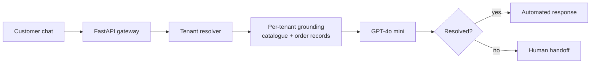
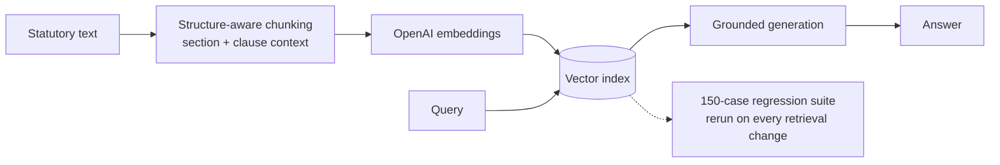
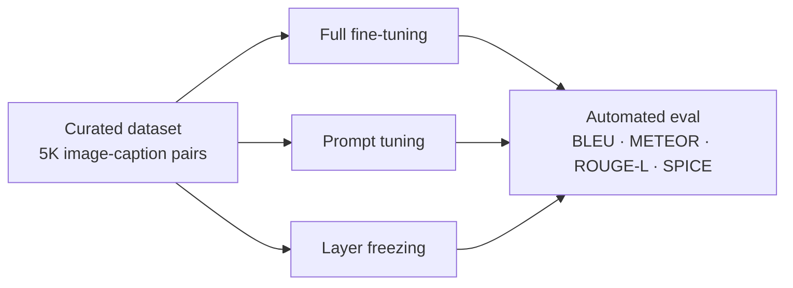

<div align="center">


[](https://www.linkedin.com/in/syedadaniyafatima)
[](https://medium.com/@sf2291650)
[](mailto:syedadaniyapk@gmail.com)

</div>

```console
$ whoami
syeda-daniya-fatima  ::  AI/ML engineer  ::  Islamabad, PK

$ cat ~/.profile
role      : AI/ML Engineer @ Wireframe Marketing
works_on  : production LLM systems, RAG, VLM fine-tuning, multi-tenant SaaS backends
approach  : ground every answer, evaluate automatically, track cost per request
studying  : MS Innovative Technologies @ NUST SEECS (2027)
```

---

## Production Telemetry

```log
[trivo-ai]    tenants=12  verticals=4  chats_per_month=3000+
[trivo-ai]    auto_resolution=0.65  cost_per_contact=$0.10  live_baseline=$8.01
[uk-law-rag]  provision_retrieval 0.62 -> 0.89  regression_suite=150  pass_rate=0.92
[blip2-ft]    bleu4=0.285  prompt_tuning=0.85x_full_ft  trainable_params=-90%
[focusflow]   session_minutes 3 -> 45  cohort=6  duration=12w
```

```text
cost per support contact
live support  ████████████████████████████████████████  $8.01
trivo-ai      ▌                                         $0.10
```

---

## Systems

### `01` Trivo AI · multi-tenant conversational assistant
`GPT-4o mini` `FastAPI` `multi-tenant` `production`

Conversational assistant running across four commerce verticals: e-commerce, restaurants, hotels, and B2B. Each tenant is grounded in its own product catalogue and order records, and conversations the model cannot resolve fall through to human support.



Write-up: [I replaced $8 support chats with 10-cent AI ones. Here's what nobody warned me about](https://medium.com/@sf2291650/i-replaced-8-support-chats-with-10-cent-ai-ones-heres-what-nobody-warned-me-about-e8f14a62d84d)

---

### `02` UK Law QA · retrieval-augmented generation
`OpenAI Embeddings` `vector search` `Python` `client · production`

Client-facing chatbot over UK statutory material. Answers are grounded in retrieved legal text to suppress the hallucinations general-purpose LLMs produce on legal questions. Chunking was tuned so section and clause context survives embedding, and a regression suite replaced manual spot checks.



| metric | before | after |
|---|---|---|
| correct-provision retrieval | 62% | **89%** |
| test pass rate | manual spot checks | **92%** over 150 cases |

---

### `03` BLIP-2 · vision-language fine-tuning
`PyTorch` `Hugging Face` `VLM` `parameter-efficient tuning`

End-to-end pipeline adapting BLIP-2 to describe unseen images: dataset curation, training, and automated multi-metric evaluation on 5K image-caption pairs. Three adaptation strategies were compared on identical metrics to find the most efficient one.



| result | value |
|---|---|
| BLEU-4, held-out test set | 0.285 |
| prompt tuning vs full fine-tuning | 85% of performance |
| trainable parameters (prompt tuning) | 90% fewer |

Code: [F219180/VLM-fine-tuning-and-downstream-application-development](https://github.com/F219180/VLM-fine-tuning-and-downstream-application-development)
Write-up: [Fine-tuning a generative vision-language transformer for image description](https://medium.com/@sf2291650/fine-tuning-a-generative-vision-language-transformer-for-image-description-2fa85f6e664b)

---

### `04` FocusFlow · adaptive cognitive rehabilitation
`adaptive ML` `gaze tracking` `human-centred design`

Four-module rehabilitation platform with personalised treatment plans. An adaptive engine calibrates task difficulty in real time from gaze tracking and controlled distraction training, with progressions tailored for children with dyslexia and ADHD. Validated through a five-stage Human-Centred Design process that surfaced and resolved five critical usability issues.

```text
focus session length (minutes), 6 users over 12 weeks
week 0   ███                                              3
week 12  █████████████████████████████████████████████   45
```

Write-up: [Teaching kids to focus by interrupting them every minute](https://medium.com/@sf2291650/teaching-kids-to-focus-by-interrupting-them-every-minute-bdc3e249272e)

---

### `05` Trivo Commerce · multi-tenant SaaS platform
`Spring Boot` `React` `MySQL` `Keycloak` `Stripe`

Core developer on the commerce platform the AI assistant runs on, spanning four verticals. Migrated 8 legacy WooCommerce stores onto it and ran 10+ concurrent production sites for US and UK clients, covering hosting, uptime, third-party integrations, and payment issue resolution.

---

## Experience

**AI/ML Engineer** · Wireframe Marketing
`Mar 2026 – Present`
- Architected and deployed Trivo AI, a multi-tenant conversational assistant serving 12 tenants and 3,000+ chats per month
- Built FocusFlow's adaptive ML engine for real-time difficulty calibration

**Associate Software Developer** · Wireframe Marketing
`Apr 2025 – Mar 2026`
- Core developer on the Trivo multi-tenant commerce platform (Spring Boot, React, MySQL, Keycloak, Stripe)
- Migrated 8 legacy WooCommerce stores and managed 10+ production sites for US and UK clients

## Education

| degree | institution | year |
|---|---|---|
| MS, Innovative Technologies | NUST SEECS, Islamabad | Expected 2027 |
| BS, Computer Science | FAST-NUCES | 2025 |

---

## Stack

| layer | tools |
|---|---|
| **models** |      |
| **retrieval** |    |
| **backend** |     |
| **languages** |      |
| **data** |    |
| **infra** |      |

---

## Activity

<p align="center">
  
  
</p>
